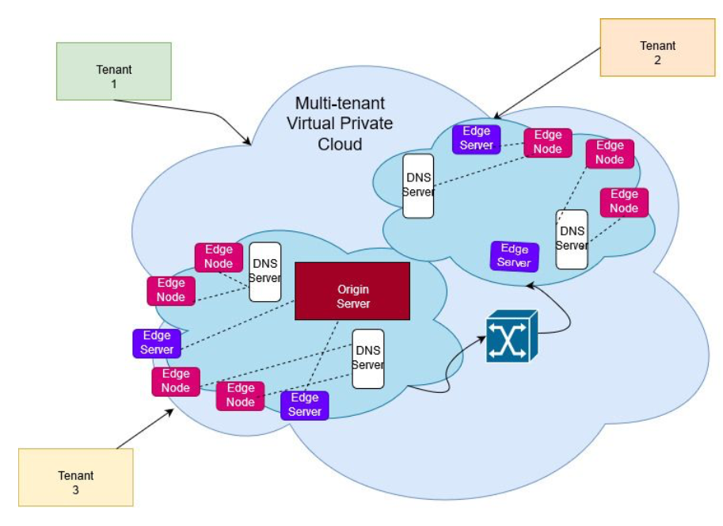
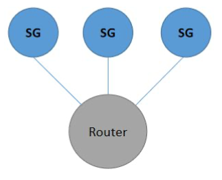
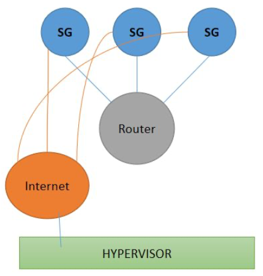
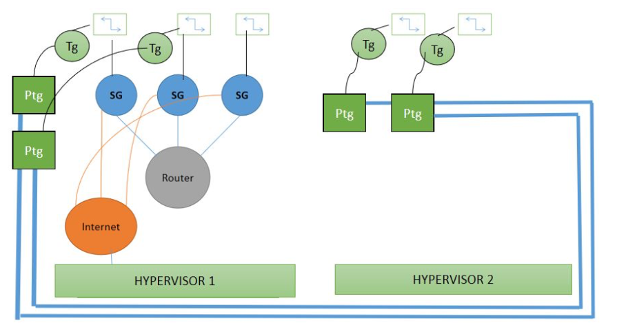

# Infrastructure and Edge Computing as a service

## Objective 
The goal is to implement edge services through content delivery networks with DNS resolution for a multi-tenant architecture. In general, edge computing brings cloud resources such as compute speeds, storage and networking, closer to applications, devices or users. This architecture allows complex event processing to happen in a system closer to the client(at edge servers), by eliminating round-trip issues and enabling actions to happen quicker (by analyzing through metrics like Round trip delay time or RTT). While CDNs are a type of node servers (broadcast points of presence -POPs) that helps or mitigates the function of the root/main/origin server in a client-server model, by providing multi-layer cache services.

In our model, we have edge devices or nodes which are connected to edge servers, making up the CDN network that is offered to our customer the client. Hence the goal of is to create a multitenant architecture that is hosted by a number of VPCs. In order to find the closest CDN node (or edge server) to an edge client, ww use content based DNS routing to find the closest edge server with the relevant cached content. For example, Netflix is configured in such a way that, 3 http links are provided for every play of the video, to start storing video data stream into a buffer, which may vary in video resolution and data bit rate.

---

# Section 1 - VPC
Flow of VPC Environment:
First we take as​ inputs from each customer​, ie. one single tenant, the following details :
1) The number of subnets they require:
a) The Subnet Id (asked on loop depending on the number of subnets they require)
b) The number of VMs (asked on loop for every subnet Id)
c) How many VCPUs do you want?
2) Do you want an Internet connection?
Ex: 3 subnets were asked.

The Python code is automated to generate the following architecture first:

Here the SG and Routers are namespaces, the SG namespace acts as the default gateway for every subnet ID specified by the tenant. The router allows inter-subnet communication within a single tenant. It has routes configured to every subnet from one another.

Following this, the tenant is also asked if they require Internet connection, upon which a namespace called Internet is created, which enables internet connectivity for all the subnet gateways of the tenant.
This Internet Namespace is connected to the Hypervisor, hosting the VPC.

After this step, the Tunnel Gateway namespaces, and OVS bridges for each subnet are created.
For the case of #subnet 1- 3Vms, subnet 2- 2Vms, subnet 3- 1 Vm we see the following two figures depicting the steps toward creating the complete architecture of the VPC.

---
## Datapath:
1. Inter subnet communication on the same hypervisor:
a. Source: L3 forwarding(VM 1)- L2 forwarding(OVS switch)- Destination: L3 forwarding(VM3) (for example in the above case)
b. The L2 switch is used to pass traffic between the two VMs.
2. Inter Subnet communication on different hypervisor:
a. Source: L3 forwarding(VM1)- L2 forwarding (OVS switch)- VXLAN TUNNEL(through Tunnel gateway(Tg) ) - L2 forwarding- Destination: L3 forwarding(VM 2)
b. So the entire topology is seen as an L2 Lan network communication
3. One subnet to another Subnet (on the same hypervisor):
a. Source: L3 forwarding(VM1)-L2 forwarding (OVS bridge)-L3 forwarding (Subnet gateway 1)- L3 forwarding(Router)- L3 forwarding(Another subnet gateway 2)- L2 forwarding (OVS switch)-Destination: L3 forwarding (VM4)
b. Router allows each tenant to have their subnets communicate with each other.
4. One subnet to another subnet (on different hypervisor):
a. Source: L3 forwarding (VM5) - Tunnel Gateway(Tg) VXLAN Tunnel - L2 forwarding (OVS switch)- L3 forwarding (Router)- L2 forwarding (OVS switch)- L3 forwarding (VM 3)
b. So every VM on the hypervisor 2 uses VXLAN tunnel to communicate with any other Vm irrespective of its own subnet or a different subnet
5. One subnet to another subnet (on Hypervisor 2):
a. Similar to the previous case:
b. Source: L3 forwarding (VM5) - Tunnel Gateway(Tg) VXLAN Tunnel - L2 forwarding (OVS switch)- L3 forwarding (Router)- L2 forwarding (OVS switch)- L2 Tunnel gateway VXLAN TUNNEL- Destination: L3 forwarding (VM 2)
 6. Any Vm to internet:
a. Source: L3 forwarding(VM1)- L2 forwarding (OVS Switch) - L3 forwarding (SG) -L3 forwarding (Internet namespace)- L3 forwarding (proj_virbro)-management interface- Public network
b. If the VM is on Hypervisor 2, then the VM goes till the OVS switch of its subnet on hypervisor 1 and follows the same path as mentioned above.
IP Address assignment Mechanism:
1. The subnets given by the customer are assigned to all interfaces from the VMs till the subnet
gateway. However we do place a hard limitation where the customer cannot give away the 185.0.0.0 subnet as it is used by the designer, to make the connections for the VXLAN tunnel and the internet data path.
2. For every LAN, by splitting the load across two hypervisors, we assign every consecutive IP address alternatively to VMs on both the hypervisors consequently giving Even or Odd addresses one each hypervisor.
3. For our functional features, our origin server which is the hypervisor 1 is given the interface IP of 24.16.10.8/24 (randomly chosen to be used).
Southbound and Northbound Interfaces:
The Northbound interface for the customer in our case is the interface on the subnet gateway that connects to the OVS bridge. This is assigned with the first address of the usable range in which the tenant as asked for (Example: 10.0.0.0- northbound interface : 10.0.0.1). The southbound interface would be the interface of every subnet gateway that connects to the router. This is assigned by the designer with /30 subnet mask in the reserved subnet ID that is 185.0.0.0/8.

--- 

# Functional Features
1. Broker server based load-balancing What is broker server based load-balancing?
When a website domain name is entered in a web-browser of a host, the host is already aware of it’s local broker server. The broker server receives a publish/subscribe request for content and returns the edge server to which the data has to be published or subscribed from.

2.  East to West Traffic
We also plan to implement east to west traffic that depicts communication between nodes in a local area network that are normally placed horizontally inside a datacenter. This type of communication is going to be shown in our project by the communication between two edge servers. The following figure shows servers in a datacenter which apply east to west traffic by traversing through the leaf switches and spine switches.

# Section 3 - Management Feature

1. Performance Management Feature description: 
	Performance management​ examines and monitors the current network efficiency and plans ahead for future changes or upgrades. While constantly monitoring the health of the network and searching for trends, network parameters are tracked and logged; these include data transmission rate (throughput), error rates, downtime/uptime, use-time percentages and response time to user and automated inputs or requests.

